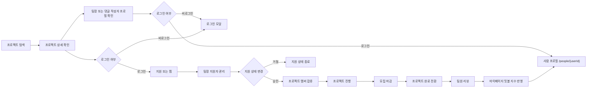

# MeetBall

<p align="center">
  
</p>

<h3 align="center">프로젝트를 만들고, 팀원을 찾고, 함께한 이력을 신뢰로 남기는 프로젝트 팀 매칭 플랫폼</h3>

<p align="center">
  <a href="https://github.com/prgrms-aibe-devcourse/AIBE5-Project2-Team01">
    
  </a>
  
  
  
  
</p>

---

## 프로젝트 소개

MeetBall은 프로젝트를 준비하는 사용자가 자신의 역할, 기술 스택, 협업 방식에 맞는 프로젝트를 찾고 직접 팀원을 모집할 수 있는 웹 서비스입니다.

커뮤니티 글, 채팅방, 오픈채팅처럼 흩어진 방식으로 팀원을 찾으면 프로젝트 목표, 모집 포지션, 기간, 기술 스택, 참여 이력, 협업 신뢰도를 한 번에 판단하기 어렵습니다. MeetBall은 프로젝트 등록부터 지원, 승인, 참여 이력, 팀원 리뷰까지 하나의 흐름으로 묶어 프로젝트 팀 빌딩 과정을 더 명확하게 만듭니다.

### 해결하려는 문제

| 문제 | MeetBall의 해결 방향 |
| --- | --- |
| 프로젝트 정보가 흩어져 탐색 비용이 큼 | 프로젝트 목록, 검색, 유형/진행 방식/포지션/기술 스택 필터 제공 |
| 조건에 맞는 팀원인지 판단하기 어려움 | 본인 전용 마이페이지와 회원 전용 공개 프로필 페이지를 분리해 프로필, 참여 이력, 공개 범위를 명확히 제공 |
| 참여 이력과 협업 피드백이 남지 않음 | 완료 프로젝트 기준 팀원 리뷰와 밋볼 지수 계산 |
| 팀장 관리 흐름이 분리되어 있음 | 지원자 목록, 승인/거절, 모집 인원 갱신을 프로젝트 관리 화면에서 처리 |
| 실제 데이터와 테스트 데이터가 혼선될 수 있음 | 운영은 Render PostgreSQL 기준, 테스트 데이터는 `src/test` 범위로 분리 |

---

## 기획 요약

프로젝트 준비 단계에서 정리한 기획 문서와 서비스 구조 설계의 핵심 내용을 README 안에 텍스트로 통합했습니다. 별도 첨부 파일 없이도 문제 정의, 사용자 흐름, MVP 화면 구조, 구현 연결 지점을 확인할 수 있습니다.

| 항목 | 내용 |
| --- | --- |
| 서비스 정의 | 프로젝트 중심 팀원 모집과 매칭 서비스 |
| 핵심 대상 | 프로젝트 경험이 필요한 주니어 개발자, 취업 준비생, 비전공자, 대학생, 부트캠프 수강생, 사이드 프로젝트 팀장 |
| 문제 배경 | 오픈채팅, 커뮤니티, 게시글 기반 모집은 프로젝트 목적, 모집 조건, 신뢰 정보, 참여 이력이 흩어져 있어 판단 비용이 큼 |
| 해결 방향 | 프로젝트 등록, 탐색, 필터, 지원, 승인, 참여 이력, 리뷰를 하나의 흐름으로 연결 |
| MVP 화면 | 홈, 프로젝트 목록, 프로젝트 상세, 프로젝트 등록, 프로젝트 관리, 마이페이지, 사람 프로필, 로그인 모달 |
| MVP 기능 | 프로젝트 등록, 검색/필터, 지원/승인, 찜, 댓글/답글, 첨부파일/링크, 리뷰, 추천, 회원 공개 프로필 |
| 신뢰 구조 | 완료 프로젝트 기준 팀원 리뷰와 받은 리뷰 기반 밋볼 지수 |
| 데이터 기준 | 운영 PostgreSQL과 테스트 H2 분리, 운영 샘플 시드 제거 |

### 사용자 페르소나

| 사용자 | 니즈 |
| --- | --- |
| 프로젝트 경험이 부족한 취업 준비생 | 포트폴리오에 남길 수 있는 프로젝트 참여 기회가 필요 |
| 주니어 개발자 | 실무와 비슷한 협업 경험과 기술 스택 기반 팀 탐색이 필요 |
| 스터디/공모전 참여자 | 기간, 역할, 진행 방식이 맞는 팀을 빠르게 찾아야 함 |
| 사이드 프로젝트 팀장 | 조건에 맞는 팀원을 모집하고 지원자를 관리해야 함 |
| 협업 이력을 남기고 싶은 사용자 | 완료 프로젝트와 팀원 리뷰를 통해 신뢰도를 쌓고 싶음 |

### 사용자와 권한 관점

기획 단계의 회원, 비회원, 팀장, 팀원, 본인/타인 구분은 실제 화면과 API 권한에도 동일하게 반영했습니다.

| 구분 | 의미 | 주요 화면/행동 |
| --- | --- | --- |
| 비회원 | 로그인하지 않은 방문자 | 홈, 프로젝트 목록/상세, 댓글 목록, 찜 개수 조회 가능. 지원, 찜 토글, 댓글 작성, 타인 프로필 조회는 로그인 필요 |
| 회원 | Google 로그인 후 세션이 있는 사용자 | 프로젝트 지원, 찜 토글, 댓글 작성, 추천, 마이페이지, 타인 공개 프로필 조회 가능 |
| 프로젝트 팀장 | 프로젝트를 만든 리더 멤버 | 지원자 조회, 승인/거절, 프로젝트 관리, 완료 전환, 팀원 답글/첨부 관리 |
| 프로젝트 팀원 | 승인되어 프로젝트에 참여 중인 멤버 | 답글 작성, 첨부 등록, 완료 프로젝트 리뷰 참여 |
| 본인 | 로그인 사용자 자신 | `/user/mypage`에서 개인 프로필, 찜, 지원, 최근 조회, 받은 리뷰 등 개인 데이터를 관리 |
| 타인 | 로그인 사용자가 조회하는 다른 회원 | `/people/{userId}`에서 공개 프로필과 만든/참여/종료 프로젝트만 조회 |

---

## 핵심 기능

| 기능 | 설명 |
| --- | --- |
| 프로젝트 탐색 | 프로젝트 목록 조회, 키워드 검색, 유형/진행 방식/포지션/기술 스택 필터 |
| 프로젝트 등록 | 제목, 소개, 설명, 기간, 모집 인원, 포지션, 기술 스택, 첨부파일, 관련 링크 등록 |
| 프로젝트 상세 | 모집 현황, 팀장 정보, 댓글, 첨부파일, 관련 링크, 리뷰 요약 조회 |
| 프로젝트 지원 | 로그인 사용자의 프로젝트 지원, 중복 지원/모집 마감/프로젝트 완료/기참여 상태 검증 |
| 지원자 관리 | 팀장 전용 지원자 조회, 승인/거절, 프로젝트 멤버 및 모집 인원 자동 갱신 |
| 찜과 최근 조회 | 프로젝트 찜 토글, 최근 읽은 프로젝트 기록 저장 및 갱신 |
| 댓글과 답글 | 댓글 목록 조회, 로그인 사용자 댓글 CRUD, 프로젝트 멤버 이상 답글 작성 가능 |
| 첨부파일과 링크 | 팀원 첨부파일 업로드, HTTP/HTTPS 링크 첨부, 다운로드 제공 |
| 리뷰와 밋볼 지수 | 완료 프로젝트 기준 팀원 리뷰 작성, 받은 리뷰 기반 밋볼 지수 계산 |
| 추천 프로젝트 | 로그인 사용자의 기술 스택과 직무/포지션을 기준으로 한 규칙 기반 추천 |
| 마이페이지 | 본인 전용 프로필, 기술 스택, 공개 여부, 찜/지원/참여/완료/최근 조회/리뷰 통합 관리 |
| 사람 프로필 | 회원 전용 타인 프로필 페이지에서 공개 프로필, 만든 프로젝트, 참여 프로젝트, 종료 프로젝트 조회 |

### 도메인별 상세

| 도메인 | 구현 내용 |
| --- | --- |
| 인증과 프로필 | Google 로그인 API로 사용자를 생성/조회하고, `HttpSession`에 `userId`, `userNickname`, Spring Security context를 저장합니다. 마이페이지는 본인 전용으로 닉네임, 직무, 기술 스택, 공개 여부를 수정할 수 있고, 타인 조회는 별도 `/people/{userId}` 공개 프로필로 분리합니다. |
| 프로젝트 탐색과 등록 | 프로젝트 목록을 페이지 단위로 조회하고, 키워드/유형/진행 방식/포지션/기술 스택 필터를 지원합니다. 등록자는 자동으로 프로젝트 `LEADER` 멤버가 됩니다. |
| 프로젝트 상세와 관리 | 상세 페이지에서 모집 현황, 팀장 정보, 기술 스택, 기간, 댓글, 첨부파일, 리뷰 요약을 확인합니다. 팀장만 관리 화면에서 지원 상태를 변경할 수 있습니다. |
| 지원, 찜, 조회 기록 | 중복 지원, 모집 마감, 프로젝트 완료, 이미 참여 중인 멤버의 지원을 차단합니다. 찜 개수는 게스트도 조회할 수 있고, 찜 토글과 개인 찜 여부는 로그인 사용자 기준으로 처리합니다. 프로젝트 상세 진입 시 최근 조회 기록을 갱신합니다. |
| 댓글과 답글 | 댓글 목록은 게스트도 조회할 수 있습니다. 로그인 사용자는 댓글을 작성, 수정, 삭제할 수 있습니다. 답글은 프로젝트 팀원 이상에게만 허용되며, 댓글 작성자만 자신의 댓글을 수정/삭제할 수 있습니다. |
| 첨부파일과 링크 | 프로젝트 멤버는 파일을 업로드할 수 있고, 저장 파일명에는 UUID를 붙여 충돌과 경로 조작을 방지합니다. 첨부 링크는 HTTP/HTTPS URL만 허용합니다. |
| 리뷰와 평판 | 완료된 프로젝트의 참여 멤버만 리뷰 대상 목록을 조회하고 리뷰를 작성할 수 있습니다. 본인 리뷰와 중복 리뷰를 차단하고, 받은 리뷰 점수로 밋볼 지수를 계산합니다. |
| 사람 프로필 | 프로젝트 상세의 팀장/댓글 작성자 링크에서 `/people/{userId}`로 이동합니다. 회원만 조회 가능하며, 본인을 조회하면 `/user/mypage`로 이동합니다. 이메일, 찜, 지원, 최근 조회, 받은 리뷰 같은 개인 데이터는 노출하지 않습니다. |

---

## 서비스 흐름



프로젝트 상태는 모집 마감(`closed=true`)과 프로젝트 완료(`completed=true`)를 분리합니다. 지원 차단과 추천 제외에는 모집 마감/완료 상태를 함께 사용하고, 팀원 리뷰와 완료 프로젝트 목록에는 프로젝트 완료 상태를 사용합니다.

마이페이지(`/user/mypage`)는 로그인한 본인만 사용하는 개인 공간입니다. 다른 사용자의 프로필과 참여 이력은 프로젝트 상세 또는 댓글 작성자 링크에서 `/people/{userId}` 사람 프로필 페이지로 확인합니다.

---

## 화면 구성

| 화면 | 경로 | 주요 역할 |
| --- | --- | --- |
| 홈 | `/` | 서비스 진입, 프로젝트 탐색으로 이동 |
| 프로젝트 목록 | `/projects` | 프로젝트 카드 목록, 검색과 필터 |
| 프로젝트 상세 | `/projects/{id}` | 프로젝트 정보, 지원, 찜, 댓글, 첨부, 리뷰 요약 |
| 프로젝트 등록 | `/register` | 팀장 기준 프로젝트 생성 |
| 프로젝트 관리 | `/projects/{id}/manage` | 팀장 전용 지원자 승인/거절 및 프로젝트 관리 |
| 마이페이지 | `/user/mypage` | 본인 전용 프로필, 지원, 찜, 읽은 프로젝트, 참여 프로젝트, 리뷰 관리 |
| 사람 프로필 | `/people/{userId}` | 회원 전용 타인 공개 프로필, 만든/참여/종료 프로젝트 조회 |

로그인은 별도 페이지가 아니라 공통 헤더에서 열리는 모달입니다. 로그인이 필요한 화면으로 직접 접근하면 홈 화면에서 로그인 모달을 열고, 성공 후 원래 요청한 경로로 돌아갑니다.

---

## 기술 스택

| 구분 | 기술 |
| --- | --- |
| Language | Java 17 |
| Framework | Spring Boot 3.5.13 |
| Backend | Spring Web, Spring Data JPA, Spring Security, Validation |
| Build | Maven Wrapper |
| View | Thymeleaf |
| Frontend | HTML, CSS, JavaScript, Tailwind CDN, Font Awesome |
| Persistence | JPA, Hibernate |
| Auth | Google ID Token, Session 기반 인증 |
| Database | PostgreSQL(Render 운영), H2(local/test) |
| Library | Lombok, Google API Client |
| Test | JUnit 5, Spring Boot Test, MockMvc |
| Deploy | Docker, Render Web Service, Render PostgreSQL |

---

## 아키텍처

### 저장소 구조

```text
.
├── .mvn/wrapper
├── src
│   ├── main
│   │   ├── java/com/example/meetball
│   │   └── resources
│   └── test
│       ├── java/com/example/meetball
│       └── resources
├── Dockerfile
├── render.yaml
├── pom.xml
├── mvnw
├── mvnw.cmd
└── README.md
```

### 백엔드 패키지

```text
src/main/java/com/example/meetball
├── controller
│   └── HomeController
├── domain
│   ├── application      # 프로젝트 지원 생성, 조회, 상태 변경
│   ├── attachment       # 파일 업로드, 다운로드, 링크 첨부
│   ├── auth             # Google 로그인, 현재 사용자 조회, 로그아웃
│   ├── bookmark         # 프로젝트 찜 상태 조회와 토글
│   ├── comment          # 댓글과 답글 조회, 작성, 수정, 삭제
│   ├── mypage           # 프로필, 지원, 찜, 참여 프로젝트, 리뷰 통합 조회
│   ├── people           # 회원 전용 타인 공개 프로필과 공개 참여 프로젝트 조회
│   ├── project          # 프로젝트 목록, 상세, 등록, 수정, 삭제, 멤버 관리
│   ├── projectread      # 최근 읽은 프로젝트 기록
│   ├── recommendation   # 사용자 기술 스택과 포지션 기반 규칙 추천
│   ├── review           # 프로젝트 리뷰, 팀원 리뷰, 밋볼 지수
│   └── user             # 사용자 조회, 프로필 수정, Google 사용자 처리
└── global
    ├── auth             # 화면 모델 사용자 주입, 권한 판정
    ├── config           # JPA, Security 설정
    └── exception        # 전역 예외 처리
```

### 리소스 구조

```text
src/main/resources
├── application.properties
├── application-local.properties
├── application-prod.properties
├── static
│   ├── css/style.css
│   └── img/logo.png
└── templates
    ├── fragments/head.html
    ├── fragments/header.html
    ├── fragments/footer.html
    ├── home/index.html
    ├── project/detail.html
    ├── project/manage.html
    ├── project/register.html
    ├── people/detail.html
    ├── user/mypage.html
    └── error.html
```

---

## 주요 API

### Auth

| Method | Endpoint | 설명 |
| --- | --- | --- |
| `POST` | `/api/auth/google` | Google ID Token 로그인 |
| `GET` | `/api/auth/me` | 현재 사용자 조회 |
| `POST` | `/api/auth/logout` | 로그아웃 |

### Project

| Method | Endpoint | 설명 |
| --- | --- | --- |
| `GET` | `/api/projects` | 프로젝트 목록 및 필터 조회 |
| `GET` | `/api/projects/{projectId}` | 프로젝트 상세 조회 |
| `POST` | `/api/projects` | 프로젝트 생성 |
| `PUT` | `/api/projects/{projectId}` | 프로젝트 수정 |
| `DELETE` | `/api/projects/{projectId}` | 프로젝트 삭제 |

### Application

| Method | Endpoint | 설명 |
| --- | --- | --- |
| `POST` | `/api/projects/{projectId}/applications` | 프로젝트 지원 |
| `GET` | `/api/users/{userId}/applications` | 사용자 지원 목록 |
| `GET` | `/api/projects/{projectId}/applications` | 프로젝트 지원자 목록 |
| `PATCH` | `/api/applications/{applicationId}/status` | 지원 상태 변경 |

### Comment, Bookmark, Attachment, Review

| Method | Endpoint | 설명 |
| --- | --- | --- |
| `GET` | `/api/projects/{projectId}/comments` | 댓글 목록 |
| `POST` | `/api/projects/{projectId}/comments` | 댓글 작성 |
| `PUT` | `/api/projects/{projectId}/comments/{commentId}` | 댓글 수정 |
| `DELETE` | `/api/projects/{projectId}/comments/{commentId}` | 댓글 삭제 |
| `GET` | `/api/projects/{projectId}/bookmarks` | 찜 개수 및 내 찜 여부 조회. 게스트는 개수만 확인 |
| `POST` | `/api/projects/{projectId}/bookmarks` | 찜 토글 |
| `GET` | `/api/projects/{projectId}/attachments` | 첨부 목록 |
| `POST` | `/api/projects/{projectId}/attachments` | 파일 첨부 |
| `POST` | `/api/projects/{projectId}/attachments/links` | 링크 첨부 |
| `GET` | `/api/projects/{projectId}/attachments/{attachmentId}/download` | 파일 다운로드 |
| `GET` | `/api/projects/{projectId}/reviews/summary` | 프로젝트 리뷰 요약 |
| `GET` | `/api/projects/{projectId}/reviews/teammates` | 리뷰 대상 팀원 목록 |
| `POST` | `/api/projects/{projectId}/reviews` | 리뷰 작성 |
| `POST` | `/api/projects/{projectId}/read` | 프로젝트 읽기 기록 저장 |

### My Page and Recommendation

| Method | Endpoint | 설명 |
| --- | --- | --- |
| `GET` | `/api/mypage/profile` | 프로필 조회 |
| `PUT` | `/api/mypage/profile` | 프로필 수정 |
| `GET` | `/api/mypage/bookmarks` | 내 찜 목록 |
| `GET` | `/api/mypage/applications` | 내 지원 목록 |
| `GET` | `/api/mypage/projects` | 참여 프로젝트 |
| `GET` | `/api/mypage/projects/completed` | 완료 프로젝트 |
| `GET` | `/api/mypage/recent-reads` | 최근 읽은 프로젝트 |
| `GET` | `/api/mypage/reviews` | 받은 리뷰 |
| `GET` | `/api/recommendations` | 추천 프로젝트 |

### People

| Method | Endpoint | 설명 |
| --- | --- | --- |
| `GET` | `/api/people/{userId}/profile` | 타인 공개 프로필 조회. 회원만 가능하며 이메일은 제외 |
| `GET` | `/api/people/{userId}/projects` | 타인의 만든/참여/종료 프로젝트 이력 조회. 회원만 가능 |

---

## 권한 정책

프로젝트 상세 화면에서의 주요 동작 권한입니다. 지원은 프로젝트 팀장/팀원에게 막히지만, 찜 토글은 로그인 사용자라면 역할과 관계없이 사용할 수 있습니다. 찜 개수와 댓글 목록 조회는 게스트도 가능하며, 개인 찜 여부와 댓글 작성/수정/삭제는 로그인 사용자 기준으로 처리합니다.

| 사용자 | 프로젝트 조회 | 지원 | 찜 토글 | 댓글 조회 | 댓글 작성 | 답글 작성 | 관리 |
| --- | --- | --- | --- | --- | --- | --- | --- |
| 게스트 | 가능 | 로그인 필요 | 로그인 필요 | 가능 | 로그인 필요 | 로그인 필요 | 불가 |
| 일반 회원 | 가능 | 가능 | 가능 | 가능 | 가능 | 불가 | 불가 |
| 프로젝트 팀원 | 가능 | 불가 | 가능 | 가능 | 가능 | 가능 | 불가 |
| 프로젝트 팀장 | 가능 | 불가 | 가능 | 가능 | 가능 | 가능 | 가능 |

### 마이페이지와 타인 프로필

마이페이지는 본인 전용 개인 공간이고, 타인 조회는 사람 프로필 페이지로 분리합니다. `/user/mypage?userId=타인`처럼 접근해도 로그인 사용자는 `/people/{userId}`로 이동하고, 비회원은 로그인 후 `/people/{userId}`로 돌아오도록 유도합니다.

| 항목 | 본인 | 타인 회원 | 게스트 |
| --- | --- | --- | --- |
| `/user/mypage` | 조회 및 수정 가능 | 접근 불가. `/people/{userId}`로 이동 | 로그인 필요 |
| 마이페이지 프로필 | 이메일 포함 상세 조회, 수정 가능 | 비공개 | 비공개 |
| 찜/지원/조회 이력 | 조회 가능 | 비공개 | 비공개 |
| 마이페이지 참여 프로젝트 | 조회 가능 | 비공개 | 비공개 |
| 받은 리뷰 | 조회 가능 | 비공개 | 비공개 |
| `/people/{userId}` 공개 프로필 | 본인 접근 시 `/user/mypage`로 이동 | 조회 가능 | 로그인 필요 |
| 사람 프로필 참여 이력 | 본인 접근 시 `/user/mypage`로 이동 | 만든 프로젝트, 참여 중인 프로젝트, 종료된 프로젝트 조회 가능 | 로그인 필요 |
| 사람 프로필 개인정보 | 본인 접근 시 `/user/mypage`로 이동 | 이메일, 찜, 지원, 최근 조회, 받은 리뷰 미노출 | 로그인 필요 |

### 프로젝트 상태 기준

| 상태 | 의미 | 주요 사용처 |
| --- | --- | --- |
| 모집 중 | `closed=false`, `completed=false` | 지원 가능 여부, 프로젝트 목록 표시 |
| 모집 마감 | `closed=true`, `completed=false` | 신규 지원 차단, 프로젝트는 계속 진행 중 |
| 프로젝트 완료 | `completed=true` | 종료 프로젝트 이력, 팀원 리뷰, 밋볼 지수 반영 |

---

## 환경 설정

기본 프로파일은 `prod`입니다. 로컬에서 실행할 때는 반드시 `SPRING_PROFILES_ACTIVE=local`을 지정합니다.

### 공통

| 변수 | 설명 |
| --- | --- |
| `SPRING_PROFILES_ACTIVE` | `local` 또는 `prod` |
| `GOOGLE_CLIENT_ID` | Google 로그인 Client ID. 기본값이 설정되어 있으며, 환경별로 교체할 때만 지정 |
| `SPRING_JPA_HIBERNATE_DDL_AUTO` | Hibernate DDL 전략 |
| `SPRING_JPA_SHOW_SQL` | SQL 로그 출력 여부 |
| `APP_SEED_ENABLED` | 로컬/테스트 검증용 샘플 데이터 생성 여부 |

Google OAuth Client ID는 브라우저에서 공개되는 식별자이므로 기본값을 설정 파일에 포함합니다. Client Secret, DB 비밀번호, Render PostgreSQL 접속 정보 같은 비밀값은 커밋하지 않습니다.

### 운영 PostgreSQL(Render)

운영 DB 정보는 전체 URL을 커밋하지 않고 아래 환경변수로 분리합니다.

| 변수 | 설명 |
| --- | --- |
| `SPRING_DATASOURCE_HOST` | PostgreSQL host |
| `SPRING_DATASOURCE_PORT` | PostgreSQL port |
| `SPRING_DATASOURCE_DB` | Database name |
| `SPRING_DATASOURCE_USERNAME` | Database user |
| `SPRING_DATASOURCE_PASSWORD` | Database password |

Render Web Service에서는 Render PostgreSQL의 Internal Host를 사용합니다. 로컬 PC에서 Render DB에 직접 접속해야 할 때만 External Host를 사용합니다.

Google 로그인은 기본 Client ID로 동작합니다. 운영 Client ID를 별도로 분리해야 할 때만 Render Environment에 `GOOGLE_CLIENT_ID`를 지정합니다.

권장 운영값:

```bash
SPRING_PROFILES_ACTIVE=prod
SPRING_JPA_HIBERNATE_DDL_AUTO=update
SPRING_JPA_SHOW_SQL=false
APP_SEED_ENABLED=false
```

### 로컬 H2

로컬 H2는 테스트나 개인 개발 확인 용도입니다. 기본값은 `APP_SEED_ENABLED=true`이며, DB가 비어 있으면 검증용 사용자, 프로젝트, 지원, 댓글, 찜, 조회, 리뷰 데이터가 자동으로 생성됩니다. 운영 Render에서는 `APP_SEED_ENABLED=false`로 비활성화합니다.

macOS, Linux, Git Bash:

```bash
SPRING_PROFILES_ACTIVE=local ./mvnw spring-boot:run
```

Windows PowerShell:

```powershell
$env:SPRING_PROFILES_ACTIVE="local"; .\mvnw.cmd spring-boot:run
```

로컬 기본 DB 파일은 `.local/meetballdb`이며 `.local/`은 Git에서 제외됩니다.

로컬 데이터를 완전히 초기화하려면 애플리케이션을 종료한 뒤 `.local/meetballdb` 파일들을 삭제하고 다시 실행합니다. 샘플 데이터 없이 확인하려면 `APP_SEED_ENABLED=false`를 함께 지정합니다.

---

## 실행 방법

Java 17을 사용합니다. 로컬 기본 Java가 17이 아니라면 `JAVA_HOME`을 Java 17 경로로 지정한 뒤 실행합니다.

```bash
./mvnw spring-boot:run
```

프로파일을 함께 지정하는 예시:

```bash
SPRING_PROFILES_ACTIVE=local ./mvnw spring-boot:run
```

Windows PowerShell 예시:

```powershell
$env:SPRING_PROFILES_ACTIVE="local"; .\mvnw.cmd spring-boot:run
```

브라우저 접속:

```text
http://localhost:8080
```

---

## 테스트와 빌드

전체 테스트:

```bash
./mvnw clean test
```

패키지 빌드:

```bash
./mvnw -DskipTests package
```
